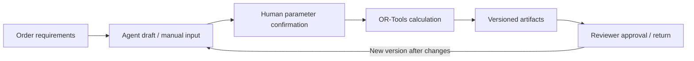

# MPCOS | Manufacturing Cutting Agent

**Turn order requirements into cutting plans that people can verify, review and trace.**

[](https://github.com/zaneliglhf-hash/MPCOS-Material-Planning-and-Cutting-Optimization-System/actions/workflows/ci.yml)
[](https://github.com/zaneliglhf-hash/MPCOS-Material-Planning-and-Cutting-Optimization-System/actions/workflows/gitguardian.yml)
[中文](README.md) · [First run and restart](docs/first-run.md) · [Operations guide](docs/workbench-delivery.md) · [Model setup](docs/deepseek-setup.md) · [MIT License](LICENSE)

MPCOS (Material Planning and Cutting Optimization System) is a Python workbench for internal employees and reviewers. An LLM turns Chinese-language requirements into structured drafts through tool calling. OR-Tools calculates profile-cutting plans; people confirm the inputs and review each version. Orders, artifacts and review decisions remain available as business records.

> [!NOTE]
> **Internal pilot, validated locally.** Deployment to the company environment, real-order process validation and employee/reviewer trials remain pending. See the [acceptance record](docs/workbench-acceptance.md).

## Workflow



## Implemented capabilities

- **Incremental requirement capture:** missing-field questions, structured drafts and validated field updates that preserve existing parameters.
- **Profile cutting:** channel steel, square tubes and rectangular tubes of one material and cross-section per order. Objectives prioritize handling batches, saw strokes, purchased stock length and pattern groups, in that order.
- **Employee/reviewer separation:** employees access their own orders; reviewers inspect and approve or return versions. Submitters cannot review their own submissions.
- **Versioned delivery:** A3 PNG, CSV, input/result JSON and review records, with procurement, offcut, utilization and finished-length summaries.
- **Recovery and integrity:** bounded background calculation, idempotent submissions, interrupted-task recovery, persistent model-request budgets and SHA-256 artifact checks.
- **Operations:** account maintenance, offline backup/restore, health checks, private-data isolation and Docker/HTTPS deployment templates.

The repository also includes an **offline rectangular sheet-layout CLI**, with box-panel expansion, multi-product nesting, rectangular remnants, geometry validation and PNG/DXF/XLSX/PDF/JSON export. The employee web app currently covers profile length cutting. Sheet nesting remains a separate CLI workflow; see the [sheet guide](docs/sheet-layout-guide.md) (Chinese).

## Quick start

**First run:** install dependencies, create internal accounts, start the service, then sign in. The web app has no public signup page; GitHub and DeepSeek accounts are separate. See the [complete walkthrough](docs/first-run.md) (Chinese).

Python 3.10–3.13 is supported. Run these commands from the repository root:

```bash
git clone https://github.com/zaneliglhf-hash/MPCOS-Material-Planning-and-Cutting-Optimization-System.git
cd MPCOS-Material-Planning-and-Cutting-Optimization-System
```

Use the commands for your operating system. Account creation is only needed once; subsequent starts use the environment's Python directly, without activation.

```bash
# macOS / Linux; first check that python3 is a supported version
python3 -m venv .venv
.venv/bin/python -m pip install -e '.[channel,web]'
.venv/bin/python -m cutting_layout.workbench create-user employee --role employee
.venv/bin/python -m cutting_layout.workbench create-user manager --role manager
.venv/bin/python -m cutting_layout.workbench serve
```

```powershell
# Windows PowerShell; first check that python is a supported version
python -m venv .venv
.\.venv\Scripts\python.exe -m pip install -e ".[channel,web]"
.\.venv\Scripts\python.exe -m cutting_layout.workbench create-user employee --role employee
.\.venv\Scripts\python.exe -m cutting_layout.workbench create-user manager --role manager
.\.venv\Scripts\python.exe -m cutting_layout.workbench serve
```

Enter passwords of at least 12 characters at the hidden prompts. Wait for the service startup message, keep the terminal running and open <http://127.0.0.1:8765> yourself. Account names are examples; there are no preset credentials or public signup page. Do not recreate existing accounts.

**Manual entry, calculation, downloads and review work without an API key.** To enable the Chinese-language Agent, run the setup command from the repository root in an interactive terminal. Use another terminal if the server is already running:

```bash
# macOS / Linux
.venv/bin/python scripts/setup_deepseek.py
```

```powershell
# Windows PowerShell
.\.venv\Scripts\python.exe scripts/setup_deepseek.py
```

Enter your own DeepSeek API key at the hidden prompt. It is saved to the local, Git-ignored `.env`; model requests use the account configured for that deployment. See the [setup guide](docs/deepseek-setup.md) (Chinese) for configuration and troubleshooting.

Create an order with its material and cross-section, provide piece lengths/quantities, available stock, kerf and a confirmed stack limit, then check the draft and record the process-parameter source. Generate a version and have another reviewer inspect the parameters and artifacts. Changes create a new version with a fresh review.

Outputs are planning aids. A qualified person must verify dimensions, orientation, kerf, end allowances, weld/assembly clearances, equipment capacity and lifting safety before cutting. MPCOS does not generate approved NC/G-code.

## Reopen after a reboot or stopped terminal

Downloading the source or opening a browser tab does not start the local server. Return to the same project folder and run:

```bash
# macOS / Linux; activation is not required
.venv/bin/python -m cutting_layout.workbench serve
```

```powershell
# Windows PowerShell
.\.venv\Scripts\python.exe -m cutting_layout.workbench serve
```

Wait for `Uvicorn running on http://127.0.0.1:8765`, keep the terminal running and open that URL yourself. Existing accounts and records remain in the deployment's data directory; do not recreate accounts or delete `var/workbench/`. Stop the service with Ctrl+C. Startup is manual; the current app does not automatically start at boot. Connection refusal, occupied ports and installation errors are covered in the [troubleshooting guide](docs/first-run.md#7-常见问题按顺序检查).

## Engineering

| Component | Implementation |
| --- | --- |
| Web/API | FastAPI and plain HTML/CSS/JavaScript; no frontend build required |
| Business records | SQLite, order/version state and append-only audit records |
| Identity | scrypt password hashing, server-side sessions, role checks and CSRF protection |
| Agent | DeepSeek tool calling, JSON Schema validation and explicit human confirmation |
| Calculation | OR-Tools profile planning, existing sheet-layout engine and shared exports |
| Maintenance | Separate calculation processes, a single-process lock, backup/restore and health checks |
| Verification | pytest/coverage gate, Node.js browser-handler regression tests, packaging and GitGuardian |

As of 2026-10-10, local verification passed **256 Python tests with 88.01% coverage**; 7 frontend regression tests are also included in CI. CI covers Python 3.10–3.13. Evidence and remaining deployment/trial requirements are documented in the [acceptance record](docs/workbench-acceptance.md).

The web app supports one host, one service process and SQLite on local disk. Deployment templates still require validation on the target machine. The [operations guide](docs/workbench-delivery.md) documents limits, maintenance and rollback.

## Standalone CLI examples

```bash
# One profile group; stock lengths and process settings come from the job file
python scripts/generate_channel_batch_plan.py examples/channel_batch_job.json --output output/channel-demo

# Multiple tube profiles with machine clamp constraints
python scripts/generate_profile_batch_plan.py examples/square_tube_job.json --output output/profile-demo

# Mixed rectangular sheet layout
python -m cutting_layout run examples/mixed_batch.json --output output/sheet-demo
```

Each profile batch contains identical bars with one repeated cut sequence. Different materials and profiles remain separate. The reusable [cutting skill](skills/channel-cutting-layout/SKILL.md) is scoped to this repository.

## Development and documentation

```bash
python -m pip install -e ".[dev,channel,web]"
python -m pytest
node --test tests/test_workbench_ui.cjs
python scripts/release_audit.py --staged
python -m build
```

Node.js 24 is used for frontend tests; the running web app does not require Node.js. The coverage gate is 85%.

- [First run, account creation and restart](docs/first-run.md) (Chinese)
- [Operations and deployment](docs/workbench-delivery.md)
- [DeepSeek setup](docs/deepseek-setup.md)
- [Acceptance and internal-trial checklist](docs/workbench-acceptance.md)
- [Sheet-layout CLI reference](docs/sheet-layout-guide.md)
- [Privacy and release boundaries](docs/privacy-and-release.md)
- [Contribution guide](CONTRIBUTING.md) and [release checklist](docs/release-checklist.md)

Use synthetic data in issues, screenshots and tests. Keep credentials, private business data and customer drawings out of source control and public artifacts. Licensed under [MIT](LICENSE).
