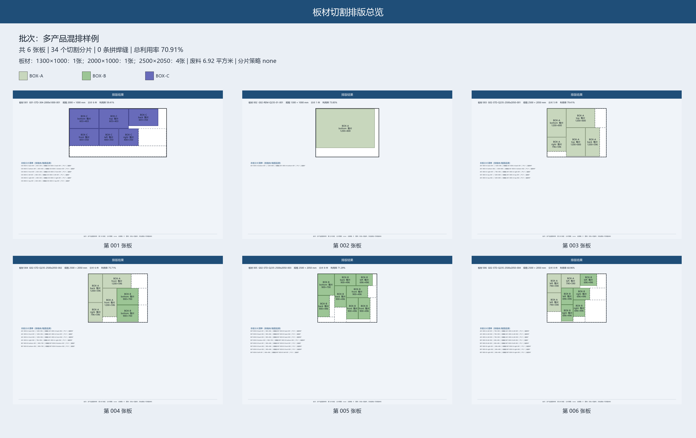

# Cutting Layout｜多产品矩形板材下料排版工具

> [!WARNING]
> 本工具采用可复现的启发式排料算法，不证明全局最优，也不能替代结构、工艺或设备人员复核。正式切割前必须人工确认尺寸口径、板厚、切缝、板边留量、连接方式、焊接余量、折弯和装配间隙。项目不生成 NC 或 G-code，不应将未经复核的输出直接用于生产。

`cutting-layout` 是一个本地 Python 命令行工具，用于将多个箱体和矩形附件展开为板件，并在兼容的标准板与矩形余料上进行跨产品混排。一次运行会先校验输入和最终几何结果，再从同一份排料方案生成 PNG、DXF、XLSX、PDF 和 JSON。



## 主要能力

- 支持箱体外形尺寸和内部净尺寸展开，以及单面尺寸/数量覆盖；
- 支持矩形附件、标准板和矩形余料；
- 只在材料、厚度、表面和方向规则一致时混排；
- 支持旋转限制、板边留量、零件间距和切缝参数；
- 可为无法整板容纳的矩形箱面生成可追溯分片；
- 按新标准板数量、余料使用、废料、可保留余料、空移距离和产品分散程度择优；
- 导出前独立检查漏件、重复、重叠、间距、越界、非法旋转、材料和统计一致性；
- 采用目录事务：任一选定格式失败时，原输出目录保持不变。

算法是确定性的启发式方法。相同输入、版本和模式会产生可复现结果，但不保证数学意义上的全局最优。

## 环境要求

- Python 3.10、3.11、3.12 或 3.13；
- Windows、macOS 或 Linux；
- 不需要数据库、云服务、Node.js 或网络连接即可运行核心功能。

## 安装

创建虚拟环境：

```bash
python -m venv .venv
```

激活环境：

```powershell
# Windows PowerShell
.\.venv\Scripts\Activate.ps1
```

```bash
# macOS / Linux
source .venv/bin/activate
```

安装项目：

```bash
python -m pip install -e .
```

开发者可安装测试和发布工具：

```bash
python -m pip install -e ".[dev]"
```

## 快速开始

运行最小虚构样例：

```bash
python -m cutting_layout run examples/minimal.json --output output/minimal-demo
```

运行多产品混排样例：

```bash
python -m cutting_layout run examples/mixed_batch.json --output output/mixed-demo
```

查看版本：

```bash
python -m cutting_layout --version
```

安装后也可以使用控制台命令 `cutting-layout` 代替 `python -m cutting_layout`。

## 选择输出格式

默认生成全部五种格式。使用 `--formats` 可以只生成需要的格式，名称不区分大小写，重复项会自动去重：

```bash
python -m cutting_layout run examples/minimal.json \
  --output output/json-and-dxf \
  --formats json,dxf
```

支持的格式：`png`、`dxf`、`xlsx`、`pdf`、`json`。空列表或未知格式属于输入错误，退出码为 `2`。

## 输出文件

| 文件 | 内容 |
|------|------|
| `previews/preview-overview.png` | 批次总览、材料组、板材缩略图和指标 |
| `previews/sheet-*.png` | 每张板材的 A3 横向比例排版图 |
| `layout-all.dxf` | 板材、板件、编号和余料分图层 CAD 文件 |
| `parts.xlsx` | 批次汇总、板件清单、排料坐标、板材与余料 |
| `cutting-report.pdf` | A3 横向可打印下料评审报告 |
| `result.json` | 所有导出共同使用的已校验结果数据 |

## 输入格式

输入为 UTF-8 JSON。所有尺寸字段使用毫米，最多两位小数。完整结构由 [JSON Schema](src/cutting_layout/schemas/cutting-layout-job.schema.json) 定义，可运行样例见 [minimal.json](examples/minimal.json) 和 [mixed_batch.json](examples/mixed_batch.json)。

关键概念：

- `dimension_basis`：`outer` 表示外形尺寸，`inner` 表示内部净尺寸；
- 箱体面：`top`、`bottom`、`front`、`back`、`left`、`right`；
- `panel_overrides`：覆盖指定产品面的最终尺寸、数量、材料或方向规则；
- `accessories`：直接录入门板、盖板等矩形件；
- `stocks`：录入 `standard` 标准板或 `remnant` 矩形余料；
- `rotation_allowed=false`：禁止板件旋转 90°；
- `mode=fast`：固定候选较少；`mode=deep`：增加固定随机种子候选。

默认展开规则请结合实际连接结构复核。程序不会自动计算折边、搭接、焊缝收缩、坡口或装配公差。

## 错误与退出码

- `0`：成功；
- `2`：输入、Schema、展开、库存、排料或安全校验错误；
- `3`：PNG、DXF、XLSX、PDF、JSON 或输出目录提交失败。

成功信息以 JSON 写到标准输出；错误以 JSON 写到标准错误。程序不会把漏件或未完成导出静默标记为成功。

## 当前范围

当前只处理完整矩形板件和矩形余料，目标上限约为单批 100 种产品、2,000 块板件。不支持孔洞、任意 DXF 轮廓导入、异形套料、折弯展开、三维结构、焊接工艺规划、NC 或 G-code。

## 槽钢批量叠切（兼容原六根订单）

安装可选求解依赖后，可按 JSON 订单生成通用人工优先批量下料图；不传参数时使用示例订单：

```bash
python -m pip install -e ".[channel]"
python scripts/generate_channel_batch_plan.py
```

求解规则为每批 1～6 根同长度原料、同一切割顺序，整批一次上料后连续切完，中途不拆批。每件按 3 mm 锯缝核算。A3 横向 PNG、CSV 和 JSON 结果写入 `output/channel-cutting-plan-batched`。

## 测试与发布检查

```bash
python -m pytest
python scripts/release_audit.py
python scripts/release_audit.py --history
python -m build
```

测试配置要求分支覆盖率不低于 85%。公开发布还需要运行 `ggshield secret scan repo .`。详细步骤见 [发布检查清单](docs/release-checklist.md)。

## 贡献

提交代码或问题前请阅读 [CONTRIBUTING.md](CONTRIBUTING.md)。不要在 issue、测试、截图或提交历史中包含客户图纸、真实订单、个人信息、密钥或其他生产数据。

## 许可证

本项目使用 [MIT License](LICENSE)。

## 通用槽钢模板 / Generic Channel Template

槽钢订单通过 JSON 输入，原材料长度可自定义：

```bash
python scripts/generate_channel_batch_plan.py examples/channel_batch_job.json \
  --output output/channel-batch-demo
```

输入字段包括 `demand`、`kerf_mm`、`stock_lengths_mm`、`max_stack`、`min_bars` 和 `max_bars`。优化顺序为最少上下料批次、最少落锯次数、最少原料总长、最少切割模式。英文说明见 [README.en.md](README.en.md)，Codex Skill 见 [skills/channel-cutting-layout/SKILL.md](skills/channel-cutting-layout/SKILL.md)。

原 13 个箱体订单已保留为 [examples/channel_batch_job_13_boxes.json](examples/channel_batch_job_13_boxes.json)，可直接复算。
