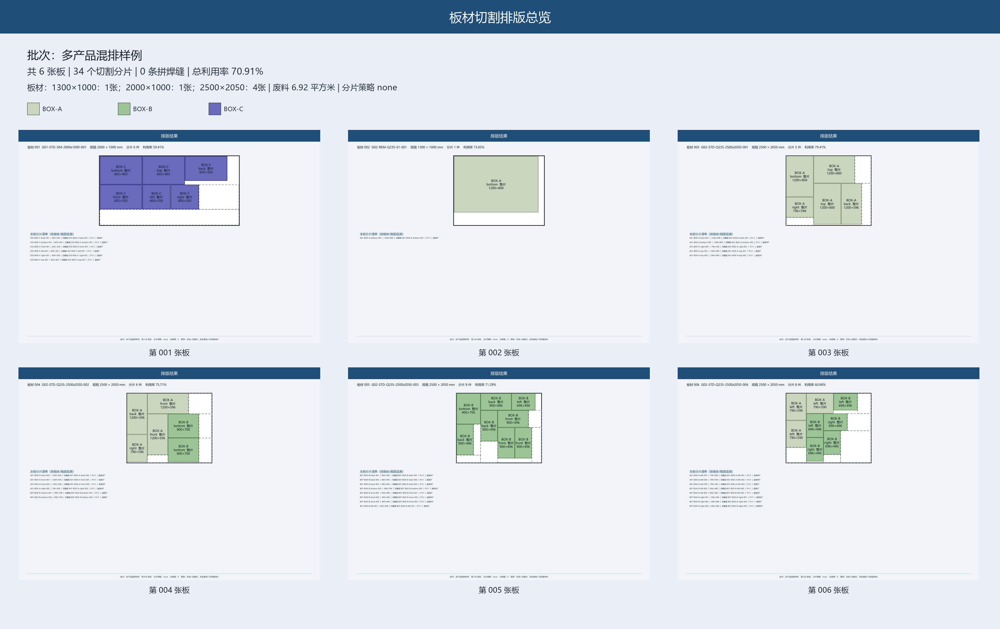

# MPCOS｜制造业下料规划 Agent

**把中文订单需求转成可核对、可留档的下料方案。**

[](https://github.com/zaneliglhf-hash/MPCOS-Material-Planning-and-Cutting-Optimization-System/actions/workflows/ci.yml)
[](https://github.com/zaneliglhf-hash/MPCOS-Material-Planning-and-Cutting-Optimization-System/actions/workflows/gitguardian.yml)
[English](README.en.md) · [首次使用与再次打开](docs/first-run.md) · [启动工作台](#快速开始) · [配置模型](docs/deepseek-setup.md) · [交付与部署](docs/workbench-delivery.md) · [MIT License](LICENSE)

MPCOS（Material Planning and Cutting Optimization System）面向内部员工和负责人，将中文需求整理、型材下料计算、方案版本和人工复核串成一个工作台。模型通过工具调用整理参数草稿；计算由 OR-Tools 完成，确认与复核由人员操作，结果保存到可查询的业务记录。

> [!NOTE]
> 当前为已完成本地验证的**内部试用版**。公司环境部署、真实订单工艺验收及员工/负责人实际试用尚待完成；具体证据见 [验收记录](docs/workbench-acceptance.md)。

## 解决什么问题

下料业务需要把长度、数量、可用原料和设备参数核对清楚，还要能找回每次修改的方案、确认依据和复核意见。MPCOS 把这些步骤放在同一笔订单下，员工通过网页提交，负责人针对具体版本复核。


```mermaid
flowchart LR
    A[员工录入需求] --> B[Agent 整理草稿 / 手工填参]
    B --> C[人工确认参数与来源]
    C --> D[OR-Tools 下料计算]
    D --> E[版本与图纸留档]
    E --> F[负责人通过 / 退回]
    F -->|修改后生成新版本| B
```

## 已实现的能力

| 业务环节 | 当前实现 |
| --- | --- |
| 中文需求整理 | DeepSeek 工具调用、缺参补问、分次补参；单字段修改保留其他已知参数，非法组合保留原草稿 |
| 型材下料计算 | 同材质、同截面的槽钢/方管/矩形管长度下料；按上下料批次、落锯次数、采购长度、切割模式数依次优化 |
| 员工与负责人协作 | 员工仅操作自己的订单；负责人查看与复核，提交人不能审核自己的版本 |
| 方案与版本 | 参数、来源、任务状态及 V1/V2 历史留档；新版本重新复核，旧版本保留 |
| 结果交付 | A3 PNG、CSV、输入/结果 JSON、版本复核记录；展示采购、余料、利用率与需求成品总长度 |
| 故障与重复操作 | 后台计算、整体超时、同编号提交去重、重启中断恢复、模型请求预算、文件 SHA-256 校验 |
| 维护与隐私 | 账号维护、离线备份恢复、健康检查、公开源码与密钥/业务数据隔离；提供 Docker 与 HTTPS 配置模板 |

仓库还保留独立的**离线矩形板材 CLI**：箱体板件展开、跨产品混排、矩形余料使用与几何校验，导出 PNG、DXF、XLSX、PDF、JSON。当前员工网页覆盖型材长度下料；板材流程通过 CLI 使用，详见 [板材工具说明](docs/sheet-layout-guide.md)。

## 快速开始

**第一次使用先看 [完整运行流程](docs/first-run.md)：安装 → 开通账号 → 启动服务 → 登录 → 生成/复核；以后重新打开只需启动服务。**

需要 Python 3.10–3.13。以下命令在项目根目录执行；首次可先克隆仓库：

```bash
git clone https://github.com/zaneliglhf-hash/MPCOS-Material-Planning-and-Cutting-Optimization-System.git
cd MPCOS-Material-Planning-and-Cutting-Optimization-System
```

按操作系统安装、首次创建两个独立角色的账号并启动。后续直接使用 `.venv` 中的 Python，无需激活环境：

```bash
# macOS / Linux；先确认 python3 为支持的版本
python3 -m venv .venv
.venv/bin/python -m pip install -e '.[channel,web]'
.venv/bin/python -m cutting_layout.workbench create-user employee --role employee
.venv/bin/python -m cutting_layout.workbench create-user manager --role manager
.venv/bin/python -m cutting_layout.workbench serve
```

```powershell
# Windows PowerShell；先确认 python 为支持的版本
python -m venv .venv
.\.venv\Scripts\python.exe -m pip install -e ".[channel,web]"
.\.venv\Scripts\python.exe -m cutting_layout.workbench create-user employee --role employee
.\.venv\Scripts\python.exe -m cutting_layout.workbench create-user manager --role manager
.\.venv\Scripts\python.exe -m cutting_layout.workbench serve
```

创建账号时在终端输入至少 12 字符的密码。看到服务运行提示后，保持终端运行，自己在浏览器打开 <http://127.0.0.1:8765> 并登录。网页没有开放注册入口，仓库不提供预设账号或密码；示例用户名可自行替换，已有账号不重复创建。

**手动填参、计算、下载和复核无需模型密钥。** 要启用中文 Agent，在项目根目录的交互式终端运行（服务已启动时另开终端）：

```bash
# macOS / Linux
.venv/bin/python scripts/setup_deepseek.py
```

```powershell
# Windows PowerShell
.\.venv\Scripts\python.exe scripts/setup_deepseek.py
```

在隐藏输入提示中填写自己的 DeepSeek API Key。配置保存在被 Git 忽略的本机 `.env`；模型请求使用该部署配置的账户。完整说明与排错见 [DeepSeek 接入指南](docs/deepseek-setup.md)。

### 重启电脑后怎么再次打开

GitHub 是源码入口，工作台服务需要在本机运行。关闭运行服务的终端或重启电脑后，回到原项目文件夹，再执行：

```bash
# macOS / Linux（无需先激活环境）
.venv/bin/python -m cutting_layout.workbench serve
```

```powershell
# Windows PowerShell
.\.venv\Scripts\python.exe -m cutting_layout.workbench serve
```

看到 `Uvicorn running on http://127.0.0.1:8765` 后，保持终端运行，再手动打开这个地址并登录。账号和数据沿用原部署，无需重新注册；停止服务按 Ctrl+C。端口占用、目录或依赖错误见 [启动排错](docs/first-run.md#7-常见问题按顺序检查)。

### 体验一笔订单

1. 用员工账号新建订单，填写材质、截面规格；不同材质或规格分别建单。
2. 提供成品长度与数量、可用原料长度、锯缝、经确认的设备叠切上限，让 Agent 整理草稿，或直接手填。
3. 核对参数、填写工艺来源并确认生成，等待后台计算完成。
4. 查阅本版统计与图纸，下载资料，再由另一位负责人填写意见并通过或退回。
5. 修改需求后生成新版本，保留旧版与意见，对新版重新复核。

工艺参数由使用方明确提供或确认，程序不以猜测替代。生成结果为计划辅助资料，实际切割前须由合格人员核对尺寸口径、型材方向、锯缝、端头余量、焊接/装配间隙、设备能力及吊装安全；不生成已批准的 NC/G-code。

## 技术实现

| 部分 | 实现与入口 |
| --- | --- |
| 业务 API 与网页 | FastAPI + 原生 HTML/CSS/JavaScript，[workbench/](src/cutting_layout/workbench/) |
| 数据与身份 | SQLite、scrypt 密码哈希、服务端会话、角色校验与追加式操作记录，[store.py](src/cutting_layout/workbench/store.py) |
| Agent 与业务流程 | DeepSeek 工具调用、Schema 校验、草稿/确认/计算/复核状态，[service.py](src/cutting_layout/workbench/service.py) |
| 计算与导出 | OR-Tools 型材求解、既有板材排样与多格式导出，[channel_batch_pipeline.py](src/cutting_layout/channel_batch_pipeline.py) |
| 运行维护 | 独立计算进程、单进程文件锁、备份恢复，[maintenance.py](src/cutting_layout/workbench/maintenance.py) |
| 自动验证 | pytest 与覆盖率门槛、Node.js 前端异步回归、打包检查、GitGuardian，[CI](.github/workflows/ci.yml) |

截至 2026-10-10，本地全量回归为 **255 项 Python 测试通过，覆盖率 87.69%**；另有 7 项前端回归纳入 CI；CI 覆盖 Python 3.10–3.13。回放、权限、异常与恢复证据见 [验收记录](docs/workbench-acceptance.md)。

当前工作台使用单台机器、单服务进程和本地 SQLite。Docker/HTTPS 模板已提供，目标环境尚需实际验证；运行范围、资源上限和更新回退见 [交付说明](docs/workbench-delivery.md)。

## 独立 CLI 与示例

```bash
# 单规格型材，原料长度与工艺参数取自 JSON
python scripts/generate_channel_batch_plan.py examples/channel_batch_job.json --output output/channel-demo

# 多规格方管，按锯床夹持范围分组与选机
python scripts/generate_profile_batch_plan.py examples/square_tube_job.json --output output/profile-demo

# 矩形板材混排
python -m cutting_layout run examples/mixed_batch.json --output output/sheet-demo
```

型材规则及可复用项目技能见 [channel-cutting-layout](skills/channel-cutting-layout/SKILL.md)。原示例订单保留在 [examples/](examples/)，可复算核对。

<details>
<summary>查看离线板材 CLI 的虚构输出示例</summary>



图中是板材 CLI 的排样结果；员工工作台的型材流程提供独立的 A3、CSV 和 JSON 资料。

</details>

## 文档与开发

| 文档 | 内容 |
| --- | --- |
| [第一次运行与再次打开](docs/first-run.md) | 安装、账号开通、启动、重启与常见故障 |
| [工作台交付说明](docs/workbench-delivery.md) | 使用流程、权限、账号、备份恢复与内网部署 |
| [DeepSeek 接入](docs/deepseek-setup.md) | 自己配置模型密钥、验证连接与常见错误 |
| [验收记录](docs/workbench-acceptance.md) | 已验证的行为与正式试用待办 |
| [板材工具说明](docs/sheet-layout-guide.md) | 板件展开、输入字段、输出格式和 CLI 范围 |
| [隐私与发布](docs/privacy-and-release.md) | 源码、业务数据、凭证与历史隐私的边界 |
| [贡献指南](CONTRIBUTING.md) / [发布检查](docs/release-checklist.md) | 开发与发布流程 |

开发验证需要额外安装 Node.js 24（仅前端测试使用；运行网页无需 Node.js）：

```bash
python -m pip install -e ".[dev,channel,web]"
python -m pytest
node --test tests/test_workbench_ui.cjs
python scripts/release_audit.py --staged
python -m build
```

提交 issue、代码、截图和日志时，使用虚构数据，避免客户图纸、真实订单、个人信息或有效密钥。本项目使用 [MIT License](LICENSE)。
